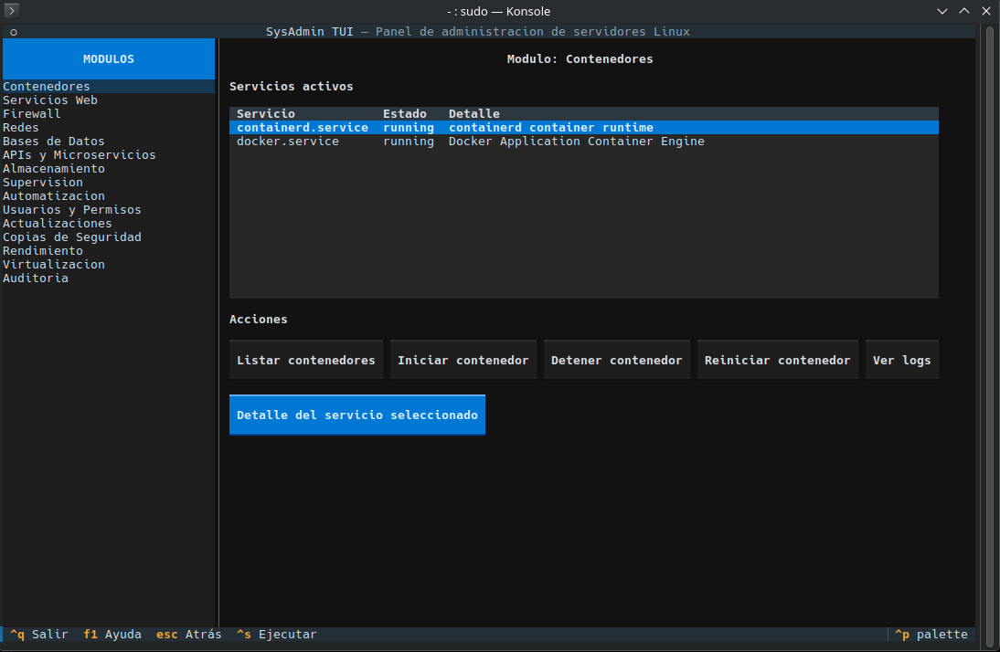

# SysAdmin TUI

Aplicacion de consola interactiva para administracion de servidores Linux.

## Vista previa

## Instalacion

1. Clonar o copiar el repositorio.
2. Ejecutar `./install.sh` como usuario normal (requiere sudo para directorios del sistema).
3. Usar el comando `sudo sysadmin-tui` para iniciar la interfaz interactiva con acceso a todas las funciones.

## Uso

Para acceder a todas las funciones administrativas, invoca el comando con `sudo`.

- Modo interactivo: `sudo sysadmin-tui`
- Modo CLI directo: `sudo sysadmin-tui <modulo> <accion> [--param valor ...]`
  Ejemplo: `sudo sysadmin-tui containers list --all`

## Configuracion

El archivo de configuracion se encuentra en `/etc/sysadmin-tui/config.yaml`. Se puede especificar una ruta alternativa con `--config`.

## Modulos

- Contenedores
- Servicios Web
- Firewall
- Redes
- Bases de Datos
- APIs y Microservicios
- Almacenamiento
- Supervision
- Automatizacion
- Usuarios y Permisos
- Actualizaciones
- Copias de Seguridad
- Rendimiento
- Virtualizacion
- Auditoria

## Registro de auditoria

Todas las acciones ejecutadas se registran en `/var/log/sysadmin-tui/audit.jsonl`.
